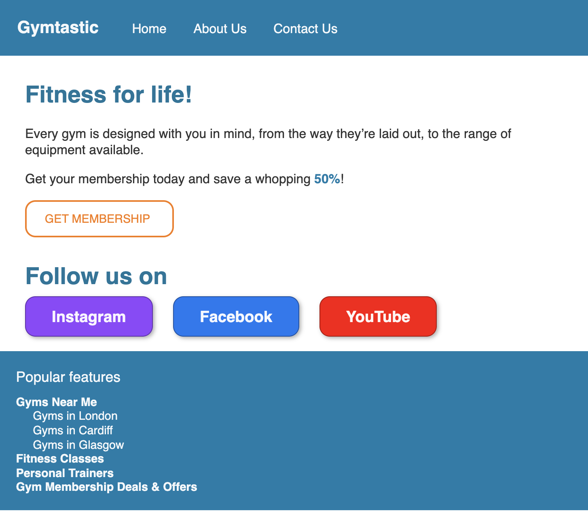

# Gymtastic

In this exercise, we'll be using everything we've learned so far about the Box Model and CSS selectors.

## Instructions
Replicate the website in the screenshot below:

## Tips
- Think about the hierarchy of the page, start by creating elements for each section, then work your way through each section until you're happy with how it looks
- Use divs for containers where appropriate
- Give your elements readable classes to easily identify and style them
- If you have multiple of something, it's probably a list. You can always style the list to your liking though!

## Extension #1
- Add a testimonial section after the follow us part!

## Extension #2
- Add a second page that links to the about us, and has the same layout and styling 
- On this page add the about information, and after creating a section that has a row of cards with different gym locations
